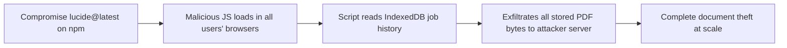
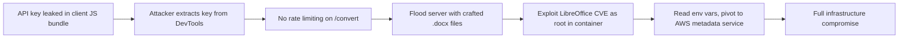
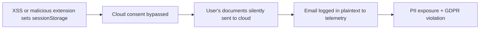

# KytePDF Security Audit Report

**Date:** 2026-04-25
**Auditor:** Adversarial Red-Team Review
**Scope:** Full codebase — frontend, cloud-gateway, infrastructure, dependencies

---

## 1. Vulnerability Summary

| Severity | Count |
|----------|-------|
| **Critical** | 3 |
| **High** | 6 |
| **Medium** | 8 |
| **Low** | 5 |
| **Total** | **22** |

---

## 2. Detailed Findings

---

### CRITICAL-01: Unpinned CDN Script — Supply-Chain RCE via Lucide

- **Severity:** Critical
- **Affected component:** [index.html:27](file:///Users/idmcalculus/Downloads/kytepdf/index.html#L27)
- **Description:** The page loads `https://unpkg.com/lucide@latest` — a **mutable `@latest` tag** from a public CDN with **no Subresource Integrity (SRI) hash**. An attacker who compromises the `lucide` npm package (typosquatting, account takeover, or unpkg cache poisoning) can inject arbitrary JavaScript that runs in every user's browser with full page context.
- **Exploitation scenario:**
  1. Attacker publishes a malicious `lucide` version or poisons the unpkg cache.
  2. Every KytePDF user's browser fetches the new payload automatically.
  3. The script accesses IndexedDB (all stored PDFs), localStorage tokens, and can exfiltrate documents or inject credential-harvesting UI.
- **Impact:** Full client-side compromise — document theft, credential harvesting, persistent XSS for every user.
- **Recommended fix:**
  1. Pin to an exact version: `lucide@0.562.0`.
  2. Add `integrity="sha384-..."` and `crossorigin="anonymous"` attributes.
  3. Preferably bundle Lucide via npm/Vite instead of using a CDN.

---

### CRITICAL-02: API Key Bypass — Empty Key Disables Auth Entirely

- **Severity:** Critical
- **Affected component:** [cloud-gateway/server.ts:526-538](file:///Users/idmcalculus/Downloads/kytepdf/cloud-gateway/server.ts#L526-L538)
- **Description:** `ensureApiKey()` returns `true` immediately when `this.config.apiKey` is empty (line 527). The default value for `CLOUD_GATEWAY_API_KEY` is `""` (line 105). If the environment variable is unset — which is the default — **all authentication is disabled** and the `/convert` endpoint is fully open to the internet.
- **Exploitation scenario:**
  1. Deploy the Docker container without setting `CLOUD_GATEWAY_API_KEY` (the default path).
  2. Any anonymous attacker can POST arbitrary files to `/convert`.
  3. The attacker uses the server as a free document-conversion proxy, or submits crafted Office documents to exploit LibreOffice vulnerabilities and gain RCE on the container.
- **Impact:** Unauthenticated access to the conversion API; potential RCE via LibreOffice exploits on crafted documents.
- **Recommended fix:**
  1. **Fail closed:** Refuse to start if `CLOUD_GATEWAY_API_KEY` is empty in production (`NODE_ENV=production`).
  2. Log a prominent startup warning in non-production environments.

---

### CRITICAL-03: API Key Exposed in Vite Client Bundle

- **Severity:** Critical
- **Affected component:** [utils/config.ts:64](file:///Users/idmcalculus/Downloads/kytepdf/utils/config.ts#L64), [utils/CloudConversionService.ts:52-53](file:///Users/idmcalculus/Downloads/kytepdf/utils/CloudConversionService.ts#L52-L53)
- **Description:** `VITE_CLOUD_GATEWAY_API_KEY` is embedded into the client-side JavaScript bundle via `import.meta.env`. Vite replaces `VITE_*` env vars at build time with their literal string values. The API key is then sent as the `X-Api-Key` header from the browser. **Any user can open DevTools → Network and read the key.**
- **Exploitation scenario:**
  1. User opens DevTools, inspects network requests or the JS bundle.
  2. Extracts the `X-Api-Key` value.
  3. Uses it to directly hit the cloud gateway, bypassing any rate limiting or consent flows.
- **Impact:** Complete API key compromise; enables unauthorized use, abuse, and cost exhaustion of the cloud gateway.
- **Recommended fix:**
  1. Remove the API key from the client bundle entirely.
  2. Implement a lightweight backend-for-frontend (BFF) proxy or use short-lived, per-session tokens issued by a server-side auth endpoint.
  3. Alternatively, use an API gateway with per-user rate limiting that doesn't rely on a shared secret.

---

### HIGH-01: No Rate Limiting on Cloud Gateway `/convert`

- **Severity:** High
- **Affected component:** [cloud-gateway/server.ts:481](file:///Users/idmcalculus/Downloads/kytepdf/cloud-gateway/server.ts#L481)
- **Description:** The `/convert` endpoint has no rate limiting. Even with a valid API key, an attacker or abusive user can flood the server with conversion requests. Each request spawns a LibreOffice process (180s timeout, 10 MB maxBuffer), which is CPU/memory-intensive.
- **Exploitation scenario:**
  1. Attacker sends 50+ concurrent conversion requests.
  2. Each spawns a `soffice` process consuming ~512 MB.
  3. The EC2 `t3.micro` (1 GB RAM, 2 vCPU) is exhausted — Denial of Service.
- **Impact:** Service Denial of Service; potential cost escalation on cloud infrastructure.
- **Recommended fix:** Add request rate limiting via Hono middleware (e.g., a sliding-window limiter keyed by IP or API key). Set a concurrency cap for LibreOffice processes.

---

### HIGH-02: LibreOffice Command Injection via Crafted Filenames

- **Severity:** High
- **Affected component:** [cloud-gateway/server.ts:338-378](file:///Users/idmcalculus/Downloads/kytepdf/cloud-gateway/server.ts#L338-L378)
- **Description:** While `sanitizeFilename()` strips most special characters, the sanitized filename is passed directly as an argument to `execFile("soffice", [..., inputPath])`. Although `execFile` (unlike `exec`) does not use a shell, LibreOffice itself interprets certain filenames. More critically, filenames beginning with `-` could be interpreted as soffice flags. The sanitizer does not strip or prefix leading dashes.
- **Exploitation scenario:**
  1. Upload a file named `--infilter=...` or `-env:UserInstallation=file:///etc/`.
  2. After sanitization: `--infilter_...` — still starts with `--`.
  3. LibreOffice interprets it as a CLI flag, potentially altering its behavior.
- **Impact:** LibreOffice behavior manipulation; potential information disclosure or unexpected file writes.
- **Recommended fix:** Prefix sanitized filenames with a safe string (e.g., `input_`) or use `--` to signal end-of-options before the input path argument. Validate that the sanitized name does not start with `-`.

---

### HIGH-03: CORS Wildcard Default Allows Cross-Origin Exploitation

- **Severity:** High
- **Affected component:** [cloud-gateway/server.ts:106](file:///Users/idmcalculus/Downloads/kytepdf/cloud-gateway/server.ts#L106), [infra/index.ts:13](file:///Users/idmcalculus/Downloads/kytepdf/infra/index.ts#L13)
- **Description:** `CORS_ORIGIN` defaults to `"*"` in both the server config and the Pulumi infrastructure. This means any website can make cross-origin requests to the conversion API. Combined with the API key being exposed in the client bundle (CRITICAL-03), any malicious site can abuse the API.
- **Exploitation scenario:**
  1. Attacker creates `evil.com` with JavaScript that sends conversion requests to the KytePDF gateway.
  2. CORS allows the request because origin is `*`.
  3. The attacker exfiltrates converted documents or uses the API as a free conversion service.
- **Impact:** Cross-origin API abuse; data exfiltration of converted documents.
- **Recommended fix:** Set `CORS_ORIGIN` to the specific production domain (e.g., `https://kytepdf.com`). Never default to `*` in production.

---

### HIGH-04: Temp File Race Condition — Symlink Attack Surface

- **Severity:** High
- **Affected component:** [cloud-gateway/server.ts:137-146](file:///Users/idmcalculus/Downloads/kytepdf/cloud-gateway/server.ts#L137-L146)
- **Description:** Temp directories are created under `os.tmpdir()` and the output file path is constructed by combining the temp dir with a format-dependent filename (`baseName.targetFormat`). Between file creation and cleanup, another process on the same host could create a symlink at the expected output path, causing LibreOffice to write to an attacker-controlled location.
- **Exploitation scenario:**
  1. In a shared-hosting or container-escape scenario, attacker monitors `/tmp/kyte-gateway-*` directories.
  2. Creates a symlink at the expected output path pointing to `/etc/passwd` or another sensitive file.
  3. LibreOffice writes the converted document to the symlink target.
- **Impact:** Arbitrary file write on the host (in container-escape scenarios).
- **Recommended fix:** Use `O_NOFOLLOW` / verify the output file is a regular file before reading. Set restrictive permissions (0700) on temp directories. Consider using a dedicated tmpfs mount.

---

### HIGH-05: Container Runs as Root

- **Severity:** High
- **Affected component:** [cloud-gateway/Dockerfile](file:///Users/idmcalculus/Downloads/kytepdf/cloud-gateway/Dockerfile)
- **Description:** The Dockerfile does not create or switch to a non-root user. The container runs all processes (Node.js, LibreOffice, OCR) as `root`. If any of these processes are compromised (e.g., via a crafted document exploiting a LibreOffice CVE), the attacker has root access inside the container.
- **Exploitation scenario:**
  1. Attacker uploads a crafted `.docx` that exploits a LibreOffice vulnerability.
  2. Gains code execution as root inside the container.
  3. Can read secrets from environment variables, pivot to the host or other containers.
- **Impact:** Full container compromise with root privileges; lateral movement risk.
- **Recommended fix:** Add `RUN useradd -r -s /bin/false appuser` and `USER appuser` to the Dockerfile. Ensure LibreOffice and OCR can run under the non-root user.

---

### HIGH-06: Infrastructure Exposes Container Port Directly to Internet

- **Severity:** High
- **Affected component:** [infra/index.ts:21-26](file:///Users/idmcalculus/Downloads/kytepdf/infra/index.ts#L21-L26), [infra/index.ts:69](file:///Users/idmcalculus/Downloads/kytepdf/infra/index.ts#L69)
- **Description:** The security group allows inbound TCP on the container port from `allowCidr` (default `0.0.0.0/0`). The EC2 instance has `associatePublicIpAddress: true`. There is no load balancer, WAF, or TLS termination. Traffic is unencrypted HTTP.
- **Exploitation scenario:**
  1. All API traffic (including the API key in headers) is sent over plain HTTP.
  2. Any network observer (ISP, Wi-Fi, transit) can intercept the API key and uploaded documents.
- **Impact:** Credential theft via network sniffing; document exfiltration in transit.
- **Recommended fix:** Place an ALB with TLS termination in front of the EC2 instance. Use ACM for certificate management. Restrict the security group to only allow traffic from the ALB.

---

### MEDIUM-01: DOM-Based XSS via innerHTML with File Names

- **Severity:** Medium
- **Affected component:** [components/BaseComponent.ts:242-250](file:///Users/idmcalculus/Downloads/kytepdf/components/BaseComponent.ts#L242-L250)
- **Description:** `renderRecentFiles()` injects `job.fileName` into HTML via `innerHTML` with only a `title` attribute sanitization. The file name displayed inside the `<span>` element is not passed through `this.sanitize()`. While the `title` attribute is safe (attribute context), the span content could contain HTML if `job.fileName` has angle brackets.

  Similarly, in [PdfSecurity.ts:597](file:///Users/idmcalculus/Downloads/kytepdf/components/PdfSecurity.ts#L597), `safeName` is properly sanitized, but the pattern is inconsistent across components — some use `this.sanitize()`, others don't.
- **Impact:** Stored XSS if a crafted filename is persisted to IndexedDB and later rendered.
- **Recommended fix:** Ensure **all** user-controlled strings injected via `innerHTML` pass through `this.sanitize()`. Consider using `textContent` assignment or a template sanitization layer.

---

### MEDIUM-02: Content-Disposition Header Injection

- **Severity:** Medium
- **Affected component:** [cloud-gateway/server.ts:497](file:///Users/idmcalculus/Downloads/kytepdf/cloud-gateway/server.ts#L497)
- **Description:** The download filename is constructed from the original uploaded filename's base name: `${baseName}.${targetFormat}`. While the filename is sanitized by `FilePolicy.sanitizeFilename()`, the `Content-Disposition` header wraps it in double quotes. If the sanitizer fails to strip all special characters in edge cases, a CRLF or quote injection could manipulate response headers.
- **Impact:** Response header injection; potential cache poisoning or XSS via content sniffing.
- **Recommended fix:** Use RFC 5987 encoding for the filename parameter: `filename*=UTF-8''${encodeURIComponent(downloadName)}`. Additionally, validate no newlines or quotes exist in the final filename.

---

### MEDIUM-03: Cloud Consent Bypass via sessionStorage Manipulation

- **Severity:** Medium
- **Affected component:** [utils/appBootstrap.ts:68](file:///Users/idmcalculus/Downloads/kytepdf/utils/appBootstrap.ts#L68)
- **Description:** Cloud consent state is stored in `sessionStorage.getItem("kyte_cloud_consent")`. Any script running in the same origin (e.g., a browser extension, XSS payload, or the console) can set this to `"true"`, bypassing the consent modal entirely. The consent is never verified server-side.
- **Impact:** User files could be sent to the cloud gateway without informed consent, creating GDPR/privacy compliance risks.
- **Recommended fix:** Consent should be a one-time user action that triggers file upload — not a pre-stored flag. The flag should not be the sole gate. Consider server-side consent verification.

---

### MEDIUM-04: Weak Owner Password Fallback to Math.random()

- **Severity:** Medium
- **Affected component:** [utils/pdfSecurity.ts:49-61](file:///Users/idmcalculus/Downloads/kytepdf/utils/pdfSecurity.ts#L49-L61)
- **Description:** `generateOwnerPassword()` falls back to `Math.random()` when `crypto.getRandomValues` is unavailable. `Math.random()` is not cryptographically secure — its output is predictable and can be reverse-engineered from a few samples. This weakens the owner password that controls PDF viewer restrictions.
- **Impact:** An attacker who can obtain a few PDFs protected by KytePDF could predict future owner passwords, allowing them to remove viewer restrictions.
- **Recommended fix:** Remove the `Math.random()` fallback entirely. If `crypto.getRandomValues` is unavailable, throw an error instead of generating a weak password. All modern browsers (and Node.js) support `crypto.getRandomValues`.

---

### MEDIUM-05: Email Logged in Plaintext

- **Severity:** Medium
- **Affected component:** [components/BaseComponent.ts:567](file:///Users/idmcalculus/Downloads/kytepdf/components/BaseComponent.ts#L567)
- **Description:** When a user provides their email, it's logged via `logger.info("User provided email", { email: result })`. In production, if telemetry is connected to a remote logging service, the email address would be sent to external services in plaintext, potentially violating privacy regulations.
- **Impact:** PII leakage to logging infrastructure; GDPR compliance risk.
- **Recommended fix:** Never log email addresses. If needed for debugging, log a hashed or truncated version.

---

### MEDIUM-06: No CSP Header on Frontend

- **Severity:** Medium
- **Affected component:** [netlify.toml](file:///Users/idmcalculus/Downloads/kytepdf/netlify.toml)
- **Description:** The Netlify configuration sets `Cache-Control` headers but does not set a `Content-Security-Policy` header. The page loads scripts from `unpkg.com` and fonts from `fonts.googleapis.com`. Without CSP, any XSS vulnerability can load arbitrary external scripts.
- **Impact:** No defense-in-depth against XSS; script injection attacks are unrestricted.
- **Recommended fix:** Add a strict CSP header:
  ```
  Content-Security-Policy: default-src 'self'; script-src 'self' https://unpkg.com; style-src 'self' 'unsafe-inline' https://fonts.googleapis.com; font-src https://fonts.gstatic.com; img-src 'self' data: blob:; connect-src 'self' <gateway-url>
  ```

---

### MEDIUM-07: Unbounded IndexedDB Storage — Client-Side DoS

- **Severity:** Medium
- **Affected component:** [utils/persistence.ts](file:///Users/idmcalculus/Downloads/kytepdf/utils/persistence.ts), [components/BaseComponent.ts:584-604](file:///Users/idmcalculus/Downloads/kytepdf/components/BaseComponent.ts#L584-L604)
- **Description:** `recordJob()` stores full PDF byte arrays (`pdfBytes`) in IndexedDB with no limit on the number of jobs or total size. Over time, this can consume gigabytes of browser storage, degrading browser performance.
- **Impact:** Client-side performance degradation; potential browser crash for power users.
- **Recommended fix:** Implement a maximum job count (e.g., 50) with LRU eviction. Don't store full PDF bytes in job history — store metadata only, or compress the bytes.

---

### MEDIUM-08: Missing HSTS and Security Headers on Frontend

- **Severity:** Medium
- **Affected component:** [netlify.toml](file:///Users/idmcalculus/Downloads/kytepdf/netlify.toml)
- **Description:** The Netlify config does not set `Strict-Transport-Security`, `X-Frame-Options`, `X-Content-Type-Options`, or `Referrer-Policy` headers for the frontend. While the cloud-gateway sets some of these via Hono's `secureHeaders()`, the frontend has none.
- **Impact:** Clickjacking attacks; MIME-type sniffing; protocol downgrade attacks.
- **Recommended fix:** Add to `netlify.toml`:
  ```toml
  [[headers]]
    for = "/*"
    [headers.values]
      X-Frame-Options = "DENY"
      X-Content-Type-Options = "nosniff"
      Strict-Transport-Security = "max-age=63072000; includeSubDomains; preload"
      Referrer-Policy = "strict-origin-when-cross-origin"
  ```

---

### LOW-01: Debug Logging Controllable via localStorage

- **Severity:** Low
- **Affected component:** [utils/config.ts:48](file:///Users/idmcalculus/Downloads/kytepdf/utils/config.ts#L48)
- **Description:** Setting `localStorage.KYTE_DEBUG = "true"` enables full debug logging in production. While this is convenient for developers, it means any user (or XSS payload) can enable verbose logging to observe internal application state.
- **Impact:** Information disclosure of internal application flow to any user.
- **Recommended fix:** Consider using a more secure debug activation mechanism (e.g., a time-limited URL parameter verified against a hash).

---

### LOW-02: Service Worker Auto-Update Skips Waiting Without User Confirmation

- **Severity:** Low
- **Affected component:** [utils/appBootstrap.ts:161](file:///Users/idmcalculus/Downloads/kytepdf/utils/appBootstrap.ts#L161)
- **Description:** The service worker registration immediately calls `skipWaiting()` and reloads the page on `controllerchange`. This means a compromised or malicious service worker update would be immediately activated without user confirmation, potentially intercepting all network requests.
- **Impact:** If the service worker file is compromised (e.g., CDN poisoning), the malicious code is immediately activated.
- **Recommended fix:** Show a user-facing "Update available" banner and let the user decide when to activate the new service worker.

---

### LOW-03: Error Stack Traces Leaked to Client in Gateway Responses

- **Severity:** Low
- **Affected component:** [cloud-gateway/server.ts:561-576](file:///Users/idmcalculus/Downloads/kytepdf/cloud-gateway/server.ts#L561-L576)
- **Description:** `handleError()` logs the full error stack trace. While the JSON response to the client uses generic messages for non-HttpError exceptions ("Conversion failed"), the `HttpError` message is forwarded directly. Some of these messages could leak internal information.
- **Impact:** Minor information disclosure about server internals.
- **Recommended fix:** Ensure all error messages sent to clients are generic and do not reveal internal paths, library names, or versions.

---

### LOW-04: Dockerfile Uses Outdated Base Image

- **Severity:** Low
- **Affected component:** [cloud-gateway/Dockerfile:1](file:///Users/idmcalculus/Downloads/kytepdf/cloud-gateway/Dockerfile#L1)
- **Description:** The base image is `node:20-bullseye` (Debian 11). Bullseye is approaching EOL and the LibreOffice, Tesseract, and Ghostscript versions in its repositories may have known CVEs. The Dockerfile does not pin package versions.
- **Impact:** Known vulnerabilities in system packages; unpredictable builds.
- **Recommended fix:** Upgrade to `node:22-bookworm` (Debian 12). Pin LibreOffice and Tesseract versions where possible. Run regular vulnerability scans on the built image.

---

### LOW-05: File Type Validation Relies Solely on MIME Type

- **Severity:** Low
- **Affected component:** [components/BaseComponent.ts:326-353](file:///Users/idmcalculus/Downloads/kytepdf/components/BaseComponent.ts#L326-L353)
- **Description:** Client-side file validation checks `file.type` which is set by the browser based on file extension — not file content. A `.exe` file renamed to `.pdf` would pass validation with `type: "application/pdf"`.
- **Impact:** Users could accidentally process non-PDF files, causing confusing errors. On the cloud gateway side, the server-side validation uses extension checks which provides a second layer.
- **Recommended fix:** Add magic-byte validation (check PDF header `%PDF-`) on the client before processing.

---

## 3. Attack Chains

### Chain A: Full Document Exfiltration (CRITICAL-01 + MEDIUM-07)



The unpinned CDN script gives the attacker full JS execution. IndexedDB stores complete PDF byte arrays in job history with no size limit, providing a rich target.

### Chain B: Cloud Gateway Takeover (CRITICAL-02 + CRITICAL-03 + HIGH-01 + HIGH-06)



The API key is in the client bundle. The gateway has no rate limiting and runs as root. HTTP traffic is unencrypted. An attacker chains these to achieve RCE and lateral movement.

### Chain C: Silent Privacy Violation (MEDIUM-03 + MEDIUM-05 + LOW-01)



An attacker bypasses consent via sessionStorage manipulation, causing documents to be uploaded without user knowledge while email addresses are logged.

---

## 4. Secure Design Recommendations

### Architecture

| Area | Recommendation |
|------|---------------|
| **API Authentication** | Replace shared API key with per-session tokens via a BFF proxy. Never embed secrets in client-side bundles. |
| **TLS Everywhere** | Add an ALB with ACM certificate. Enforce HTTPS. Set HSTS. |
| **Container Hardening** | Run as non-root. Use read-only filesystem. Drop all Linux capabilities except those needed. Use `--security-opt=no-new-privileges`. |
| **Rate Limiting** | Implement per-IP and per-key sliding-window rate limiting on the gateway. Cap concurrent LibreOffice processes. |
| **CSP** | Deploy a strict Content-Security-Policy on the frontend. Eliminate inline scripts. |

### Code Patterns

| Pattern | Action |
|---------|--------|
| **HTML Injection** | Replace all `innerHTML` usage with DOM APIs (`textContent`, `createElement`) for user-controlled data. Create a centralized template sanitizer. |
| **Secret Management** | Use AWS Secrets Manager or Parameter Store for API keys. Inject at runtime, not build time. |
| **Dependency Pinning** | Pin all CDN scripts with SRI hashes. Better: bundle everything via Vite. |
| **Fail Closed** | Require explicit configuration for security-critical settings. Never default to permissive (empty API key, `CORS *`). |
| **Logging Hygiene** | Never log PII. Implement a PII-scrubbing layer in the logger. |

### Operational

| Area | Recommendation |
|------|---------------|
| **Image Scanning** | Add Trivy or Grype scanning in CI for the Docker image. |
| **Dependency Auditing** | Add `bun audit` / `npm audit` to the CI pipeline. The `xlsx` package (SheetJS) is known to have had vulnerabilities. |
| **WAF** | Deploy AWS WAF in front of the ALB with rules for request size, rate limiting, and known attack patterns. |
| **Monitoring** | Add alerting for unusual conversion volumes, failed auth attempts, and LibreOffice process crashes. |

---

## 5. Threat Model Summary

### Attacker Profiles

| Profile | Entry Points | Target Assets |
|---------|-------------|---------------|
| **Anonymous Web User** | Frontend UI, browser DevTools | Stored PDFs in IndexedDB, API key in JS bundle |
| **Malicious Website Operator** | Cross-origin requests to gateway | Free conversion API abuse, document exfiltration |
| **Supply Chain Attacker** | npm package compromise, CDN poisoning | Full client-side control, all user documents |
| **Network Observer** | Unencrypted HTTP to gateway | API keys, uploaded documents in transit |
| **Insider / Co-tenant** | Shared container host, `/tmp` access | Temp files, symlink attacks, environment variables |

### Trust Boundaries

```
┌─────────────────────────────────────────────────┐
│  Browser (Untrusted)                            │
│  ┌──────────────┐  ┌─────────────────────────┐  │
│  │ localStorage │  │ IndexedDB (PDFs, jobs)  │  │
│  └──────────────┘  └─────────────────────────┘  │
│  ┌──────────────────────────────────────────┐   │
│  │ Client JS Bundle (API key embedded!)     │   │
│  └──────────────────────────────────────────┘   │
└──────────────────┬──────────────────────────────┘
                   │ HTTP (no TLS!)
                   ▼
┌──────────────────────────────────────────────────┐
│  Cloud Gateway (EC2, root, no WAF)               │
│  ┌────────────┐ ┌────────────┐ ┌──────────────┐ │
│  │ Hono API   │ │ LibreOffice│ │ ocrmypdf     │ │
│  └────────────┘ └────────────┘ └──────────────┘ │
│  Environment: CLOUD_GATEWAY_API_KEY (plaintext)  │
└──────────────────────────────────────────────────┘
```

> [!CAUTION]
> The three critical findings (unpinned CDN script, empty API key bypass, and client-embedded API key) represent **immediate, exploitable risks** that should be addressed before any production deployment.
